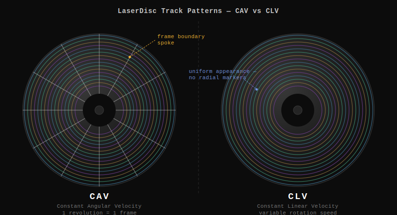
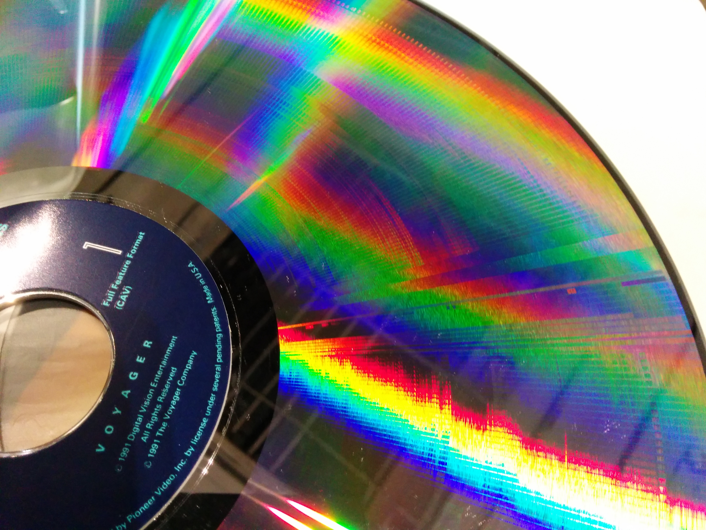

# Decoding a Pioneer LaserActive MLD RF Capture to Video
## A Technical Manual for the *Virtual Cameraman* Dual-Program LaserDisc

---

## Table of Contents

1. [Background and Concepts](#1-background-and-concepts)
2. [Prerequisites](#2-prerequisites)
3. [Source Material](#3-source-material)
4. [Pipeline Overview](#4-pipeline-overview)
5. [Step 1 — RF Decode with ld-decode](#5-step-1--rf-decode-with-ld-decode)
6. [Step 2 — VBI Processing](#6-step-2--vbi-processing)
7. [Step 3 — Chroma Decode and Field Separation](#7-step-3--chroma-decode-and-field-separation)
8. [Step 4 — Audio Channel Splitting](#8-step-4--audio-channel-splitting)
9. [Step 5 — Cleanup](#9-step-5--cleanup)
10. [Final File Inventory](#10-final-file-inventory)
11. [Troubleshooting](#11-troubleshooting)
12. [Current Challenges — Towards an MMI for Ares](#12-current-challenges--towards-an-mmi-for-ares)

---

## 1. Background and Concepts

### 1.1 What Is a LaserDisc RF Capture?

Inside a LaserDisc player, an analog signal chain converts the optical signal read from the disc into a standard composite video output. Most LaserDisc "rips" go through this chain and are recorded at the composite output — meaning the signal has already passed through the player's internal circuits, accumulating noise, chroma crosstalk, and time-base jitter.

An **RF capture** goes further upstream. It taps the raw **FM (Frequency Modulated) signal** directly from the disc mechanism, before the player does any demodulation. This raw signal — containing luma, chroma, sync, audio, and metadata all multiplexed together as FM sidebands — is digitised at high sample rate and stored to disk. The result is a perfect digital copy of the signal as it came off the disc surface, entirely independent of the player's aging analog circuits.

The file format used here is `.ldf` (**LaserDisc Frequency capture**), a raw PCM recording of the RF signal at approximately 40 Msps. A single disc side typically produces 300–500 GB of data.

### 1.2 What Is ld-decode?

**ld-decode** is an open-source, software-defined LaserDisc RF decoder. It replicates — entirely in software — the signal processing that a LaserDisc player's hardware would perform:

- FM demodulation of the luma (brightness) channel
- Time-base correction (TBC) to remove mechanical jitter
- Dropout detection and concealment
- EFM digital audio extraction
- Analog FM audio demodulation
- VBI (Vertical Blanking Interval) metadata decoding

Because it operates on a perfect digital recording of the raw signal, ld-decode can produce output quality that exceeds what any real player hardware can achieve, particularly for discs with surface wear or pressing defects.

ld-decode is the core of a broader ecosystem of tools — `ld-chroma-decoder`, `ld-process-vbi`, `ld-analyse`, and others — all sharing the same TBC file format.

### 1.3 What Is a TBC File?

The primary output of ld-decode is a `.tbc` (**Time-Base Corrected**) file. This is a raw, uncompressed video file containing every field of the LaserDisc, stored as 16-bit luma samples at the disc's native resolution:

- **910 samples wide × 263 lines per field** for NTSC (including active picture and blanking)
- Fields are stored sequentially: field 1, field 2, field 3, …
- No compression, no colour information — luma only

Colour information is encoded in the luma signal itself (as the NTSC colour subcarrier) and is extracted separately by `ld-chroma-decoder`.

A companion **`.tbc.db`** SQLite database stores per-field metadata: signal-to-noise ratio, detected dropouts, VBI content (frame numbers, timecodes, chapter markers), and sync quality metrics.

### 1.4 What Is a Dual-Program LaserDisc?

Standard NTSC video is **interlaced**: each video frame consists of two **fields** captured at slightly different moments in time.

- The **top field** (also called the odd field) contains lines 1, 3, 5, 7, … of the picture
- The **bottom field** (also called the even field) contains lines 2, 4, 6, 8, …
- Fields alternate at **59.94 Hz**; two fields make one complete frame at **29.97 fps**

On some Japanese LaserDiscs — particularly idol and gravure video titles — a technique was used to encode **two entirely different programs** on alternating fields:

- Odd fields → Program A
- Even fields → Program B

A specialised player (or a player with a hardware switch) could select which field set to display, effectively choosing between the two programs. The analog FM stereo audio tracks were correspondingly split: the **left channel** carries Program A's audio, and the **right channel** carries Program B's audio.

When decoded naively — treating both fields as a normal interlaced pair — the result looks like severe combing: each "frame" contains one field from Program A interleaved with one field from Program B, creating a picture with half-resolution horizontal stripes of two completely different scenes. Correct extraction requires separating the two field sets entirely.

### 1.5 What Is the Pioneer LaserActive?

The Pioneer LaserActive (CLD-A100/CLD-A200) was a hybrid LaserDisc/Mega Drive/PC Engine console released in 1993. It played standard LaserDiscs as well as **MLD (Mega LaserDisc)** titles — LaserDiscs that contained game data or extended content accessible only through the console's add-on modules. The `RF-MLD_` prefix in the filename indicates this is an MLD disc captured from a LaserActive player.

### 1.6 CAV vs CLV — Visual Identification

LaserDiscs were mastered in one of two formats:

- **CAV (Constant Angular Velocity)**: The disc rotates at a fixed speed (1,800 rpm for NTSC; 1,500 rpm for PAL). Each complete revolution stores exactly one video frame. This 1:1 relationship between revolution and frame enables still-frame, slow-motion, and random frame access — features used extensively by MLD and interactive titles. CAV discs hold up to 30 minutes of video per side (36 minutes for PAL).

- **CLV (Constant Linear Velocity)**: The disc spins faster near the centre and slower toward the edge, maintaining a constant track speed. This allows up to 60 minutes per side for NTSC (64 minutes for PAL) but loses the fixed frame-per-revolution relationship, making still-frame and random frame access impossible without special hardware.

You can distinguish the two formats visually by inspecting the disc surface under a light source:

- **CAV discs** show prominent radial streaks — "spokes" — radiating outward from the hub. These appear because every adjacent track shares the same angular frame-start position, creating a consistent radial zone of slightly different reflectivity across the entire playing area.

- **CLV discs** have a uniform, smooth iridescent appearance with no radial patterning. The track is a true continuous spiral with no fixed angular frame boundaries.



The photograph below shows a CAV LaserDisc. The spoke pattern is clearly visible as bright radial streaks in the iridescent reflection. Note the disc label explicitly reads "(CAV)":



*Photo: [Autopilot](https://commons.wikimedia.org/wiki/File:Laserdisc_CAV.jpg), [CC BY-SA 3.0](https://creativecommons.org/licenses/by-sa/3.0/)*

All MLD titles are NTSC — the LaserActive was only sold in Japan and North America, both NTSC markets. Most MLD titles are CAV. The `"format"` field in MediaInfo.json (`"NTSC-CAV"` or `"NTSC-CLV"`) should reflect what you observe on the disc itself.

### 1.7 MLD Disc Structure — Where the Game Code Lives

An MLD disc carries three distinct content types, which map directly to the three streams in MediaInfo.json:

| Stream | Type | Content |
|--------|------|---------|
| `AnalogVideo` | QON | FMV frames (frame-addressable video) |
| `AnalogAudio` | Raw PCM | Analog FM stereo audio |
| `DigitalAudio` | Redbook bin/cue | Game code **and** digital audio |

The `DigitalAudio` label is slightly misleading. A Redbook bin/cue is not just audio — it is a complete CD disc image, and CD images can contain **data tracks** (Mode 1 or Mode 2/XA) alongside audio tracks. On an MLD disc the EFM digital track is a mixed disc: the data tracks carry the Mega Drive or PC Engine game ROM and assets; the audio tracks carry the digital stereo soundtrack.

The LaserActive's add-on module (Mega Drive PAC-S1 or PC Engine PAC-N1) reads the game code from those data tracks exactly as it would from a normal Mega CD or PC Engine CD-ROM disc. There is no separate "code" stream in the MMI JSON because the bin/cue is already the complete disc image that the emulator's CD-ROM layer consumes.

From the emulator's perspective:

- **QON** → video renderer (frame-addressable, required for sync'd FMV, reverse playback, and still-frame)
- **PCM** → analog audio output
- **bin/cue** → CD-ROM drive emulation (game logic, data assets, and digital audio tracks)

---

## 2. Prerequisites

### 2.1 Disk Space

The pipeline requires substantial disk space at peak:

| Item | Approximate Size |
|------|-----------------|
| LDF source file (zipped) | ~210 GB |
| LDF source file (unzipped) | ~400 GB |
| TBC output | ~49 GB |
| Final video files (both programs) | ~30 GB |
| **Peak total needed** | ~480 GB |

If you decode directly to the same drive where the LDF lives, plan for ~500 GB free. If working on a separate drive, you need ~80 GB for outputs alone.

### 2.2 System Requirements

- Modern multi-core CPU (10 threads recommended)
- 8 GB RAM minimum, 16 GB recommended
- macOS (this manual targets macOS; Linux is also well supported)

### 2.3 Building ld-decode from Source

Install build dependencies (Homebrew):

```bash
brew install cmake qt6 ffmpeg python@3.14
```

Clone the repository with submodules:

```bash
git clone --recursive https://github.com/happycube/ld-decode.git
cd ld-decode
```

Build (out-of-source, as required by the project):

```bash
mkdir build
cd build
cmake -DCMAKE_BUILD_TYPE=RelWithDebInfo ..
make -j8
```

After a successful build, the key binaries are:

| Binary | Location |
|--------|----------|
| `ld-decode` (Python) | `build/python-build/scripts-3.14/ld-decode` |
| `ld-chroma-decoder` | `build/tools/ld-chroma-decoder/ld-chroma-decoder` |
| `ld-process-vbi` | `build/tools/ld-process-vbi/ld-process-vbi` |
| `ld-analyse` (GUI) | `build/tools/ld-analyse/ld-analyse.app` |
| `efm-decoder-f2` | `build/tools/efm-decoder/tools/efm-decoder-f2/efm-decoder-f2` |
| `efm-decoder-audio` | `build/tools/efm-decoder/tools/efm-decoder-audio/efm-decoder-audio` |

### 2.4 Python Virtual Environment

The Python frontend of ld-decode uses **numba** for JIT (Just-In-Time) compilation of the signal processing code. Without numba, decoding is 10–100× slower. Set up a virtual environment once:

```bash
python3 -m venv myenv
source myenv/bin/activate
pip install numba numpy
```

You must activate this environment before running ld-decode:

```bash
source /path/to/myenv/bin/activate
```

### 2.5 ffmpeg

Verify ffmpeg is installed and recent:

```bash
ffmpeg -version
```

Version 5.0 or later is recommended. Install or update via Homebrew:

```bash
brew install ffmpeg
# or
brew upgrade ffmpeg
```

---

## 3. Source Material

The RF capture used in this manual is publicly archived at:

```
https://archive.org/details/virtual-cameraman-pioneer-laseractive-discdump-hiresscans
```

The LDF file can be downloaded directly from:

```
https://archive.org/download/virtual-cameraman-pioneer-laseractive-discdump-hiresscans/RF-MLD_Virtual%20Cameraman_2022-12-22_12-49-13.zip
```

Extract the ZIP archive to obtain:

```
RF-MLD_Virtual Cameraman_2022-12-22_12-49-13.ldf
```

An LDF file is a raw, continuous stream of RF samples with no inherent concept of disc sides. Whether a given file contains one side or both depends entirely on how the capture was performed.

This particular disc is **physically single-sided**: Side 1 contains the programme, and the reverse bears the standard Japanese single-sided LD notice — "This is a single-sided disc. Please flip it over to use it" — indicating no playable content on that face. The archive.org item therefore contains a single LDF which is a **complete capture of the entire disc**. The two output files produced by this pipeline (`VC_prog1_final.mov` and `VC_prog2_final.mov`) together represent the full video content of the disc.

---

## 4. Pipeline Overview

The full process from LDF to final video files:

```
RF-MLD_Virtual Cameraman_2022-12-22_12-49-13.ldf
        │
        │  ld-decode  (~2–4 hours)
        │  Demodulates FM signal, corrects time base,
        │  extracts audio, detects dropouts
        ▼
VC.tbc + VC.tbc.db + VC.pcm + VC.efm
        │
        │  ld-process-vbi  (~5 minutes, optional)
        │  Decodes VBI metadata into the database
        ▼
VC.tbc.db  (enriched with frame numbers, timecodes, chapters)
        │
        │  ld-chroma-decoder | ffmpeg  (~10 minutes)
        │  Decodes colour, deinterleaves dual programs,
        │  scan-doubles fields, muxes stereo audio
        ▼
VC_prog1.mov + VC_prog2.mov  (ProRes 422 HQ, stereo audio)
        │
        │  ffmpeg remux  (~10 seconds each)
        │  Stream-copies video, splits audio channels
        ▼
VC_prog1_final.mov + VC_prog2_final.mov
(ProRes 422 HQ video, correct mono audio per program)
```

---

## 5. Step 1 — RF Decode with ld-decode

This is the most time-consuming step. ld-decode reads the entire LDF file sequentially, processing the RF signal field by field.

### 5.1 Command

```bash
# Activate the Python virtual environment first
source myenv/bin/activate

~/ld-decode/build/python-build/scripts-3.14/ld-decode \
    --NTSCJ \
    --threads 10 \
    --start 1 \
    "RF-MLD_Virtual Cameraman_2022-12-22_12-49-13.ldf" \
    VC
```

### 5.2 Options Explained

**`--NTSCJ`**
Selects the NTSC-J (Japan) signal standard. NTSC-J differs from US NTSC in its black and white level definitions:
- US NTSC: black at 7.5 IRE (the "setup" or pedestal), white at 100 IRE
- NTSC-J: black at 0 IRE (no setup), white at 100 IRE

Using the wrong standard shifts the luminance range and results in crushed blacks or clipped whites. Always use `--NTSCJ` for Japanese LaserDiscs.

**`--threads 10`**
Number of parallel processing threads. ld-decode parallelises across fields. Set this to your CPU's logical core count. Using more threads than cores does not help and may slightly hurt performance due to context switching.

**`--start 1`**
Begin decoding from field 1. This is the default behaviour when the flag is omitted, but specifying it explicitly ensures the decode starts from the very beginning of the disc.

**`"RF-MLD_Virtual Cameraman_2022-12-22_12-49-13.ldf"`**
The input RF capture file. Quotes are required because of the spaces in the filename.

**`VC`**
The output basename. All output files are named `VC.*`. Choose a short, descriptive name.

### 5.3 Output Files

| File | Size | Description |
|------|------|-------------|
| `VC.tbc` | ~49 GB | Raw time-base corrected luma video fields |
| `VC.tbc.db` | ~15 MB | Per-field metadata database (SQLite) |
| `VC.pcm` | ~305 MB | Analog FM stereo audio, raw s16le PCM |
| `VC.efm` | ~1.5 GB | EFM-encoded digital audio bitstream |
| `VC.log` | ~5 MB | Decode log (progress, statistics, dropout counts) |

### 5.4 What ld-decode Is Doing

During decoding, ld-decode logs progress like this:

```
Frame 1234/54417: File Frame 1236: CAV Frame #1168
```

- **Frame N/54417**: Current field index out of the estimated total
- **File Frame**: The actual sequential field index in the TBC file
- **CAV Frame**: The frame number encoded in the VBI (the "real" frame number on the disc)

For a CLV (Constant Linear Velocity) disc like this one, the frame number increments continuously through the program. The total of ~54,417 frames equates to approximately 30 minutes of content at 29.97 fps.

### 5.5 Expected Duration

On a machine with 10 threads and fast storage, expect 2–4 hours. The bottleneck is CPU — specifically the numba-JIT-compiled FM demodulator. Ensure the virtual environment with numba is active; without it, the pure-Python fallback is many times slower.

---

## 6. Step 2 — VBI Processing

The Vertical Blanking Interval occupies the non-visible lines at the top of each field (lines 1–19 for NTSC active fields). It contains metadata encoded by the disc mastering studio:

- **Frame numbers** (for CLV discs, used for chapter navigation)
- **Timecodes** (VITC — Vertical Interval Time Code)
- **Chapter markers**
- **Copy generation management** flags
- **Programme status** bytes

`ld-process-vbi` reads the TBC file, decodes this metadata field by field, and writes it into the `.tbc.db` database.

### 6.1 Command

```bash
~/ld-decode/build/tools/ld-process-vbi/ld-process-vbi VC.tbc
```

The tool reads `VC.tbc`, updates `VC.tbc.db` in place, and completes in a few minutes. It produces no separate output file.

### 6.2 Why This Matters

While not strictly required for video export, VBI data is used by `ld-analyse` for navigation and by other tools for chapter detection. Running it once after the decode is good practice and costs little time.

---

## 7. Step 3 — Chroma Decode and Field Separation

This is the most technically complex step. It pipes the output of `ld-chroma-decoder` directly into `ffmpeg`, which applies the field separation filtergraph and encodes both programs simultaneously.

### 7.1 Understanding the ld-chroma-decoder Output

`ld-chroma-decoder` reads the raw luma TBC and performs NTSC colour decoding, separating the colour subcarrier from the luma signal and producing a full-colour YUV video stream. Its output is:

- **Format**: YUV4MPEG2 (y4m), piped to stdout
- **Pixel format**: YUV444P16 (4:4:4 colour sampling, 16 bits per channel)
- **Resolution**: 760 × 488 pixels per frame
- **Frame rate**: 29.97 fps
- **Field order**: Top field first (TFF)

The resolution (760 × 488) is slightly wider than the broadcast-standard 720 × 480, to include some horizontal overscan area from the disc.

### 7.2 Understanding the Interlacing Problem

The 760 × 488 output is an **interlaced frame**: it contains two fields superimposed:

```
Line 0:   top field, line 0    ← Program A
Line 1:   bottom field, line 0 ← Program B
Line 2:   top field, line 1    ← Program A
Line 3:   bottom field, line 1 ← Program B
...
Line 486: top field, line 243  ← Program A
Line 487: bottom field, line 243 ← Program B
```

For a normal (non-dual-program) interlaced disc, lines 0 and 1 would be the same scene captured 1/59.94 of a second apart. But on this dual-program disc, they are from two completely different programs. Playing this as-is causes the familiar "combing" look — horizontal stripes of two different images.

### 7.3 The Deinterlacing/Separation Filtergraph

The ffmpeg filtergraph that separates the two programs:

```
[0:v]il=l=d:c=d,split[o][e];
[o]crop=iw:ih/2:0:0,scale=iw:ih*2:flags=neighbor,setsar=352/413[p1];
[e]crop=iw:ih/2:0:ih/2,scale=iw:ih*2:flags=neighbor,setsar=352/413[p2]
```

**Step by step:**

**`il=l=d:c=d`** — The `il` (interleave/deinterleave) filter in deinterleave mode.

This takes the interleaved frame and **repackages** it into a stacked layout:
- The even-numbered source lines (0, 2, 4, … → Program A) are packed consecutively into lines 0–243
- The odd-numbered source lines (1, 3, 5, … → Program B) are packed consecutively into lines 244–487

The output frame is still 760 × 488 — same dimensions — but the two programs are now physically separated into the top and bottom halves. The frame rate and timing are unchanged.

*Important: the filter mode `d` here means "deinterleave" (from interleaved to stacked). The naming is from the perspective of field storage, not processing direction — do not confuse with `i` (interleave, i.e., from stacked to interleaved).*

**`split[o][e]`** — Creates two identical copies of the stacked stream, labelled `[o]` and `[e]`.

This is necessary because we want to crop different halves from the same frame. `split` does not separate fields — it duplicates the stream so the next filters can work on two independent copies.

**`[o]crop=iw:ih/2:0:0`** — Crops copy `[o]` to the **top half**.

Parameters: `width=iw` (full input width), `height=ih/2` (half the input height), `x=0`, `y=0` (top-left corner). This extracts Program A (760 × 244).

**`[e]crop=iw:ih/2:0:ih/2`** — Crops copy `[e]` to the **bottom half**.

Same as above but `y=ih/2` — starts halfway down. This extracts Program B (760 × 244).

**`scale=iw:ih*2:flags=neighbor`** — **Scan-doubles** each field back to full height.

Each field at 760 × 244 represents the content of the full picture, but at half vertical resolution. Doubling the height with nearest-neighbour interpolation (`flags=neighbor`) gives 760 × 488 — each original line is simply duplicated rather than blended. Nearest-neighbour is essential here: any blending (bilinear, bicubic, Lanczos) would mix pixels from Program A with pixels from Program B, producing a blurred composite. Nearest-neighbour keeps them completely separate.

**`setsar=352/413`** — Restores the correct **pixel aspect ratio**.

NTSC video uses non-square pixels. At 760 × 488, the correct SAR (Sample Aspect Ratio) is 352:413 ≈ 0.852. This means each pixel is slightly taller than it is wide, so that the displayed image is 4:3:

```
Display width  = 760 × (352/413) ≈ 648.6
Display height = 488
DAR = 648.6 : 488 ≈ 4:3 ✓
```

The problem: when ffmpeg crops the frame to half-height (760 × 244) and then scales it back to 760 × 488, it incorrectly assumes it should **preserve the DAR of the intermediate cropped frame**. The 760 × 244 frame with SAR 352:413 has a DAR of approximately 2.66:1 (very wide). Scaling it to 760 × 488 with that preserved DAR yields SAR 704:413 — the video would display at 2.66:1 instead of 4:3.

`setsar=352/413` overrides ffmpeg's automatic SAR adjustment and restores the correct value.

### 7.4 The Chroma Decoder: `-f ntsc3d`

ld-chroma-decoder offers several NTSC decoder modes:

| Mode | Description |
|------|-------------|
| `ntsc1d` | 1D comb filter. Fast, lower quality. |
| `ntsc2d` | 2D comb filter (spatial). Good quality for static content. |
| `ntsc3d` | **3D adaptive comb filter (spatial + temporal)**. Uses information from adjacent frames to better separate luma from chroma. Best quality for motion content, but requires more memory. |
| `ntsc3dnoadapt` | 3D filter without adaptive switching. |
| `mono` | Luma only, no colour decoding. |

`ntsc3d` is recommended for this content (fast-moving video) as it significantly reduces dot crawl (chroma interference on fine luma detail) and cross-colour (luma patterns appearing as false colour).

### 7.5 The Full Command

```bash
~/ld-decode/build/tools/ld-chroma-decoder/ld-chroma-decoder \
    -f ntsc3d \
    -p y4m \
    -t 10 \
    VC.tbc - | \
ffmpeg \
    -f yuv4mpegpipe -i - \
    -f s16le -ar 44100 -ac 2 -i VC.pcm \
    -filter_complex "
        [0:v]il=l=d:c=d,split[o][e];
        [o]crop=iw:ih/2:0:0,scale=iw:ih*2:flags=neighbor,setsar=352/413[p1];
        [e]crop=iw:ih/2:0:ih/2,scale=iw:ih*2:flags=neighbor,setsar=352/413[p2]
    " \
    -map "[p1]" -map 1:a -c:v prores_ks -profile:v 3 -c:a pcm_s16le VC_prog1.mov \
    -map "[p2]" -map 1:a -c:v prores_ks -profile:v 3 -c:a pcm_s16le VC_prog2.mov
```

### 7.6 ffmpeg Input Options Explained

**`-f yuv4mpegpipe -i -`**
Reads a YUV4MPEG2 stream from stdin. The `-f yuv4mpegpipe` forces ffmpeg to parse stdin as y4m format (it cannot auto-detect format from a pipe). The y4m stream header carries resolution, frame rate, colour space, and field order.

**`-f s16le -ar 44100 -ac 2 -i VC.pcm`**
Opens the raw PCM audio file with explicit format parameters:
- `-f s16le`: signed 16-bit little-endian samples
- `-ar 44100`: sample rate of 44100 Hz (see Section 8.3)
- `-ac 2`: stereo (2 channels)

### 7.7 ffmpeg Output Options Explained

**`-map "[p1]" -map 1:a`**
Selects the `[p1]` video stream (from the filtergraph) and audio stream 0 from input 1 (the PCM file) for the first output file.

**`-c:v prores_ks -profile:v 3`**
Encodes video as **ProRes 422 HQ** (profile 3 = High Quality). ProRes is Apple's standard intermediate/archival codec:
- **Near-lossless**: perceptually indistinguishable from uncompressed at typical viewing conditions
- **10-bit colour depth**: preserves the full bit depth from the TBC decode
- **4:2:2 chroma sampling**: appropriate for video content
- **Native QuickTime/Final Cut playback**: no additional codecs needed on macOS
- **~15 GB per program**: approximately 4× smaller than raw v210 uncompressed

For purely archival use where maximum fidelity is required, substitute `-c:v v210` (uncompressed 10-bit 4:2:2, ~51 GB per file).

**`-c:a pcm_s16le`**
Stores audio as uncompressed 16-bit PCM — no loss, small overhead relative to video size.

### 7.8 Expected Output Specifications

Both output files should have identical video specifications:

| Property | Value |
|----------|-------|
| Codec | ProRes (HQ) — `apch` |
| Resolution | 760 × 488 |
| Frame rate | 29.97 fps (30000/1001) |
| Field order | Progressive |
| SAR | 75:88 (= 352:413 simplified) |
| DAR | 7125:5368 ≈ 4:3 |
| Audio | PCM s16le, 44100 Hz, mono |
| Duration | ~30 minutes |
| File size | ~15 GB each |

### 7.9 Expected Duration

Approximately 10 minutes on a 10-thread machine. ld-chroma-decoder typically processes at 150–280 fps; ProRes 422 HQ encoding is the lighter bottleneck.

---

## 8. Step 4 — Audio Channel Splitting

### 8.1 The Dual-Channel Audio Layout

The analog FM audio from this disc is stereo, with the two channels carrying different program audio:

- **Left channel (c0)** → audio for one of the two programs
- **Right channel (c1)** → audio for the other program

After completing Step 3, open both `VC_prog1.mov` and `VC_prog2.mov` and compare their audio. One audio channel will match each video program (the other will belong to the second program and will be audibly unrelated to the video). Identify which is which before proceeding.

### 8.2 Commands

These operations are very fast because the video is **stream-copied** (no re-encoding). Only the audio is processed.

```bash
# Assign left channel (c0) to prog1
ffmpeg \
    -i VC_prog1.mov \
    -f s16le -ar 44100 -ac 2 -i VC.pcm \
    -map 0:v -c:v copy \
    -map 1:a -af "pan=mono|c0=c0" -c:a pcm_s16le \
    VC_prog1_final.mov

# Assign right channel (c1) to prog2
ffmpeg \
    -i VC_prog2.mov \
    -f s16le -ar 44100 -ac 2 -i VC.pcm \
    -map 0:v -c:v copy \
    -map 1:a -af "pan=mono|c0=c1" -c:a pcm_s16le \
    VC_prog2_final.mov
```

**`-map 0:v -c:v copy`**: takes the video stream from the input MOV file and passes it through unchanged (stream copy — no decode, no re-encode, no quality loss).

**`-af "pan=mono|c0=c0"`**: the `pan` filter extracts a single channel. `c0=c0` means "output channel 0 = input channel 0 (left)". For the right channel, use `c0=c1`.

If the audio does not match the video after this step, simply re-run the two commands with `c0=c0` and `c0=c1` swapped. The operation takes only seconds.

### 8.3 Audio Sample Rate

ld-decode outputs analog FM audio at **44100 Hz** — the standard CD sample rate. This is the default value of the `--analog_audio_frequency` parameter in ld-decode and can be confirmed in the source (`lddecode/main.py`). It can be overridden on the command line if needed, but 44100 Hz is correct for the vast majority of captures.

### 8.4 EFM Digital Audio (Advanced, Optional)

The `.efm` file contains the disc's **EFM (Eight-to-Fourteen Modulation) digital audio** — equivalent to CD-quality audio, encoded using the same physical format as audio CDs. Decoding it requires a two-step pipeline using the tools built with ld-decode:

```bash
# Step 1: Decode EFM T-values to F2 sections
~/ld-decode/build/tools/efm-decoder/tools/efm-decoder-f2/efm-decoder-f2 \
    VC.efm VC.f2

# Step 2: Decode F2 sections to WAV audio
~/ld-decode/build/tools/efm-decoder/tools/efm-decoder-audio/efm-decoder-audio \
    VC.f2 VC_digital.wav
```

The resulting `VC_digital.wav` is standard 44100 Hz stereo CD-quality audio.

Note: on this dual-program disc, the EFM digital audio may cover only one of the two programs, or may be formatted differently from the analog tracks. Compare both sources when building the final archive.

---

## 9. Step 5 — Cleanup

Once the final files are verified, the intermediate files can be removed to reclaim disk space:

```bash
rm VC_prog1.mov VC_prog2.mov
```

**Do not delete** the source TBC files (`VC.tbc`, `VC.tbc.db`) unless disk space is critically needed. Re-running the RF decode step takes 2–4 hours and requires the original LDF file to be available. The TBC is the lossless intermediate from which any number of different exports can be made (different decoder settings, different crop regions, lossless codec, etc.).

---

## 10. Final File Inventory

After completing the pipeline:

| File | Size | Keep? | Description |
|------|------|-------|-------------|
| `VC_prog1_final.mov` | ~15 GB | ✓ Yes | Program 1: ProRes 422 HQ + mono PCM audio |
| `VC_prog2_final.mov` | ~15 GB | ✓ Yes | Program 2: ProRes 422 HQ + mono PCM audio |
| `VC.tbc` | ~49 GB | ✓ Recommended | Lossless source for re-export |
| `VC.tbc.db` | ~15 MB | ✓ Yes | Per-field metadata database |
| `VC.pcm` | ~305 MB | ✓ Yes | Raw analog audio source |
| `VC.efm` | ~1.5 GB | Optional | EFM digital audio bitstream |
| `VC.log` | ~5 MB | Optional | Decode log |
| `VC.tbc.json` | ~27 MB | Optional | Legacy JSON metadata export |

---

## 11. Troubleshooting

### Video has interlace combing (horizontal line artifacts throughout motion areas)

The interlaced fields are being displayed as a progressive frame without deinterlacing. This typically means:

- The player (QuickTime on macOS) is not deinterlacing the content. QuickTime does not auto-deinterlace interlaced video.
- The `il=l=d:c=d` filtergraph was not applied.

For a **normal (non-dual-program) interlaced disc**, the correct approach is bob deinterlacing via yadif, which outputs one frame per field (doubling the frame rate to 59.94 fps):

```bash
ld-chroma-decoder -f ntsc3d -p y4m -t 10 VC.tbc - | \
ffmpeg -f yuv4mpegpipe -i - \
    -vf "yadif=mode=1:parity=-1:deint=0" \
    -c:v prores_ks -profile:v 3 \
    VC_deinterlaced.mov
```

`yadif=mode=1` outputs one frame per field (bob). `parity=-1` auto-detects field order from the stream header.

Do **not** use `yadif` on a dual-program disc — it will blend pixels from both programs together.

### Alternating frames show completely different scenes

This is the expected symptom of a dual-program disc decoded without field separation. The `il=l=d:c=d` + split + crop filtergraph from Step 3 is required.

### Audio is silent on one or both programs

The audio may have been assigned to the wrong channel, or both programs received the same channel. Re-run Step 4 with channels swapped.

### Audio drifts out of sync over time

The audio sample rate specified to ffmpeg (`-ar`) does not match the actual sample rate in the PCM file. Use exactly `44100` for ld-decode NTSC analog audio output.

### Wrong aspect ratio (video appears stretched horizontally ~2× too wide)

The `setsar=352/413` filter was omitted from the filtergraph. Without it, ffmpeg preserves the intermediate DAR from the cropped half-height frame (≈ 2.66:1) rather than the correct 4:3 display ratio. Add `,setsar=352/413` at the end of each crop+scale chain.

### ld-decode is very slow (many hours, not 2–4 hours)

The Python virtual environment with `numba` is not active, or numba failed to compile. Verify:

```bash
# Check that numba is installed in the active environment
python3 -c "import numba; print(numba.__version__)"
```

If numba is not found, the decode falls back to pure Python — expect 10–20× slower performance. Re-install: `pip install numba`.

### ld-decode crashes or produces corrupted output

- Verify the LDF file integrity (check against archive.org checksums if available)
- Ensure sufficient disk space — ld-decode writes the TBC file incrementally and will fail silently or corrupt output if it runs out of space
- Check `VC.log` for error messages

### macOS disk shows less free space than expected after deleting files

macOS APFS uses local Time Machine snapshots that can hold "deleted" data until disk pressure forces their removal. Run:

```bash
tmutil deletelocalsnapshots /
```

to immediately release snapshot-held space.

---

## 12. Current Challenges — Towards an MMI for Ares

The pipeline described in this manual produces clean, archival-quality video files (`VC_prog1_final.mov`, `VC_prog2_final.mov`). Creating an MMI package for the [Ares emulator](https://ares-emu.net) requires a further conversion step for each of the three MMI streams. This section documents the known challenges and open questions as of the time of writing.

### 12.1 AnalogVideo — Why QON, Not a Standard Video Format

A natural question is: why not use the ProRes `.mov` files produced by this pipeline directly as the video stream?

The answer is frame addressability. Ares cannot use standard video container formats (MOV, MP4, MKV, etc.) for LaserDisc video because those formats are built around sequential playback. Their codecs use inter-frame compression — P-frames and B-frames that encode only the *difference* from neighbouring frames — which means decoding any given frame requires first decoding the frames before it. That is fundamentally incompatible with how a LaserDisc player operates: the hardware must be able to jump instantly to any arbitrary frame number, freeze on a single frame indefinitely, and play backwards or at variable speed. Games such as *Rocket Coaster* exercise all of these capabilities continuously during gameplay.

The **QON format** (from [github.com/RogerSanders/qon](https://github.com/RogerSanders/qon), a LaserActive-specialised fork of the QOI image format) solves this by storing every frame as an independently compressed, individually addressable unit — effectively a flat array of frames with no inter-frame dependencies. Any frame can be sought to and decoded in isolation, in constant time.

The source for the QON encode is the TBC file (`VC.tbc`), not the finished `.mov` files. The `.mov` files have already had the dual-program fields separated and scan-doubled; the TBC contains the raw interlaced output of ld-decode, closer to what the original hardware would have read off the disc.

### 12.2 AnalogVideo — The Dual-Program Complication

*Virtual Cameraman* is a dual-program disc: odd fields carry Program A and even fields carry Program B. This raises an open question for the QON stream:

**Should the QON contain the raw interleaved frames as they appear in the TBC (both programs on alternating fields), or should it contain two separate QON files — one per program?**

The answer depends on how the LaserActive hardware (and therefore the Ares emulator) selects between programs. If the hardware simply plays back the raw field stream and the add-on module selects odd or even fields at display time, the QON should contain the unmodified interleaved output of ld-chroma-decoder. If the hardware or software expects pre-separated streams, two QON files would be needed.

This question is currently unresolved and is being discussed with the Ares development team.

### 12.3 AnalogAudio — Status

The analog audio source (`VC.pcm`) is already in the correct format for the `AnalogAudio` MMI stream: raw s16le PCM, 44100 Hz, stereo. No conversion is required beyond confirming the channel-to-program mapping (left channel → one program, right channel → the other) and whether the MMI expects a split mono file or the full stereo PCM.

### 12.4 DigitalAudio — EFM to Redbook bin/cue

The digital audio pipeline as far as WAV is documented in [Section 8.4](#84-efm-digital-audio-advanced-optional):

```
VC.efm → efm-decoder-f2 → VC.f2 → efm-decoder-audio → VC_digital.wav
```

What remains undocumented is the step from `VC_digital.wav` to a properly structured **Redbook bin/cue** suitable for the `DigitalAudio` MMI stream. For a standard MLD title this bin/cue is a mixed disc image: data tracks carry the game ROM and assets, audio tracks carry the digital soundtrack. The correct toolchain and track layout for assembling this from the decoded EFM output has not yet been established for this disc.

### 12.5 Summary of Open Questions

| # | Question | Status |
|---|----------|--------|
| 1 | Should the QON contain raw interleaved fields or pre-separated per-program streams? | Open — pending Ares team input |
| 2 | Does the `AnalogAudio` stream expect stereo PCM or split mono files? | Open |
| 3 | What is the correct toolchain and track layout for building a Redbook bin/cue from the decoded EFM output? | Open |
| 4 | How are lead-in and lead-out frame counts determined for `framesInLeadInRegion` / `framesInLeadOutRegion` in MediaInfo.json — from `VC.tbc.db`, or counted manually? | Open |

---

*Manual based on a decode session performed on 2026-05-22 using ld-decode commit c42e0a0c, ffmpeg 8.1.1, macOS 25.5.0.*

*Pipeline design, filtergraph derivation, and manual written with assistance from **Claude Sonnet 4.6** (Anthropic), via [Claude Code](https://claude.ai/code).*
